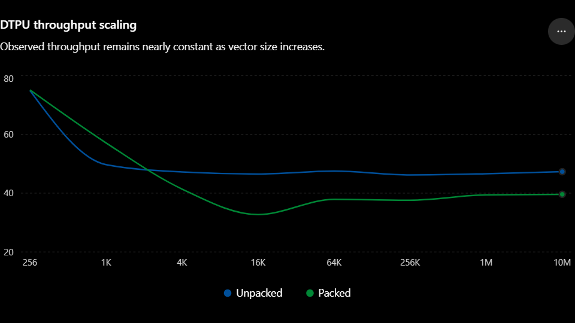

# DTPU
Distributed Ternary Processing Unit

A research prototype exploring ternary-encoded AI inference acceleration on commodity hardware.

## Overview

DTPU investigates the use of ternary-encoded storage and computation to increase information density during AI inference workloads.

Instead of storing binary values, DTPU stores trits:

-1 → 10
 0 → 00
+1 → 01

The unused state:

11

is reserved for error detection.

## Current Features

- Trit arithmetic
- Trit vectors
- Packed trit vectors
- Dot product kernels
- Packed dot product kernels
- Automated testing framework
- Benchmarking framework

## Benchmark Results

Current benchmark results on:

- Host Platform
- GCC 15.2.0
- C++20

### Throughput Scaling

| Vector Size | Unpacked MTrit/s | Packed MTrit/s |
|------------|-----------------|----------------|
| 256 | 74.9 | 75.1 |
| 1K | 49.7 | 57.1 |
| 4K | 47.2 | 41.4 |
| 16K | 46.5 | 32.7 |
| 64K | 47.5 | 37.9 |
| 256K | 46.2 | 37.6 |
| 1M | 46.6 | 39.4 |
| 10M | 47.3 | 39.6 |

## Key Observation

Packed ternary storage achieves approximately 4× information density while sustaining approximately 80–85% of the throughput of the unpacked implementation.

For large workloads (>64K trits), throughput remains stable near:

- Unpacked: ~47 MTrit/s
- Packed: ~39 MTrit/s

This demonstrates that ternary packing provides substantial storage savings with a relatively modest execution overhead.

## Repository Structure

libtrit/
├── include/
├── src/

tests/
├── test_trit.cpp
├── test_vector.cpp
├── test_ops.cpp
├── test_packed_vector.cpp

benchmarks/
├── benchmark_main.cpp
├── benchmark_dot_product.cpp

src/
└── main.cpp

